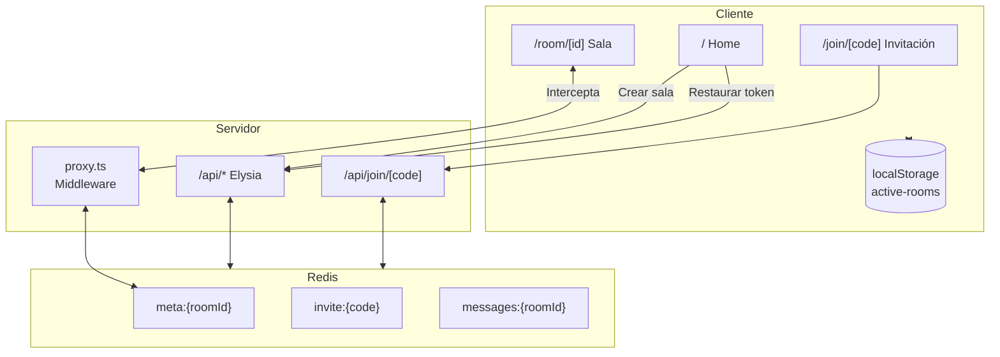
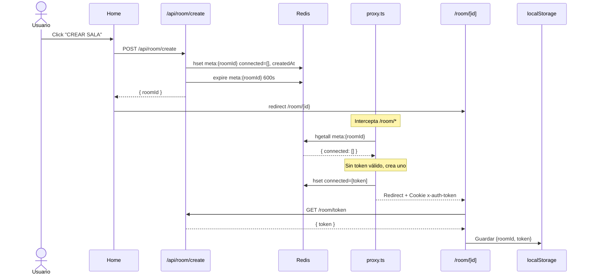
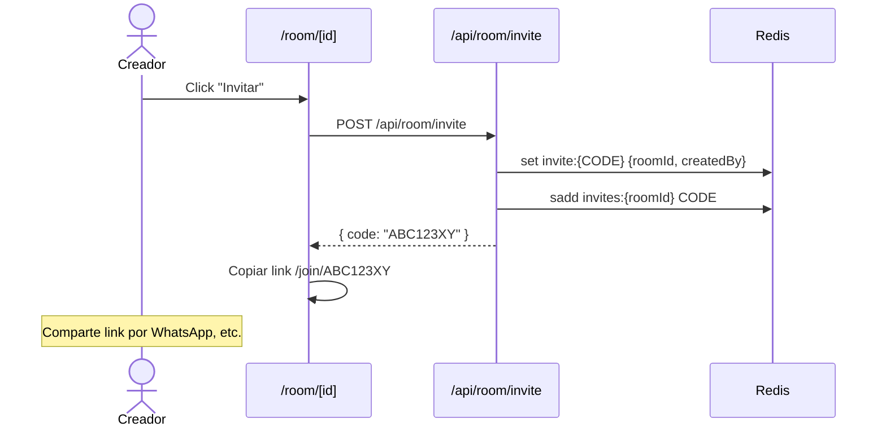
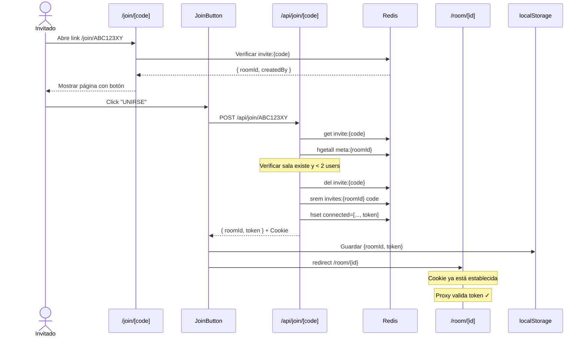
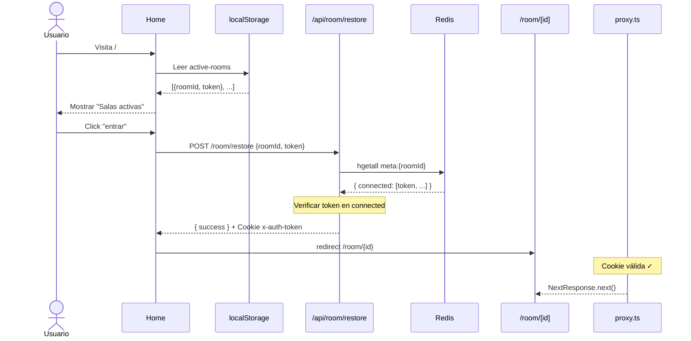
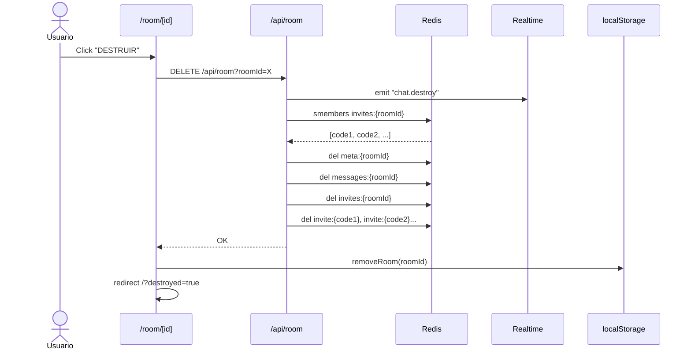
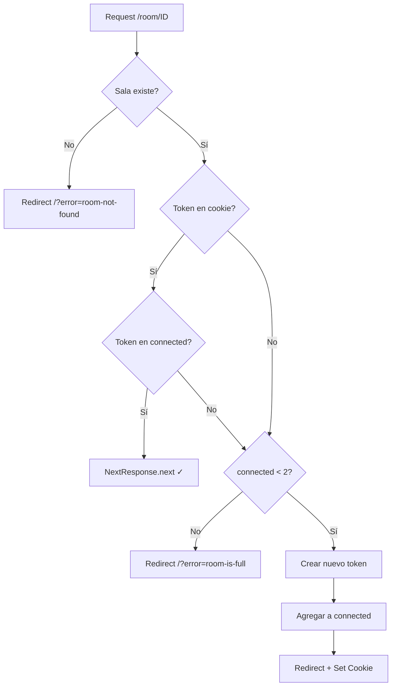

# Arquitectura del Sistema de Chat

## Visión General



---

## Estructuras de Datos en Redis

| Key                 | Tipo        | Campos                        | TTL    |
| ------------------- | ----------- | ----------------------------- | ------ |
| `meta:{roomId}`     | Hash        | `connected[]`, `createdAt`    | 10 min |
| `messages:{roomId}` | List        | Mensajes del chat             | 10 min |
| `invite:{code}`     | String/JSON | `roomId`, `createdBy`         | 5 min  |
| `invites:{roomId}`  | Set         | Códigos de invitación activos | 10 min |

---

## Flujo 1: Crear Sala (Creador)



---

## Flujo 2: Invitar Usuario



---

## Flujo 3: Unirse con Invitación



---

## Flujo 4: Volver a Entrar (Salas Activas)



---

## Flujo 5: Destruir Sala



---

## Middleware Proxy (proxy.ts)



---

## Autenticación (auth.ts)

```mermaid
flowchart TD
    A[Request API] --> B{roomId en query?}
    B -->|No| C[401 Unauthorized]
    B -->|Sí| D{Cookie x-auth-token?}
    D -->|No| C
    D -->|Sí| E[Leer meta:{roomId}]
    E --> F{token en connected?}
    F -->|No| C
    F -->|Sí| G[Continuar ✓<br/>auth: {roomId, token, connected}]
```

---

## localStorage: active-rooms

```typescript
interface ActiveRoom {
  roomId: string; // ID de la sala
  token: string; // Token de autenticación
  joinedAt: number; // Timestamp de cuando se unió
}

// Ejemplo
[
  { roomId: "abc123", token: "xyz789", joinedAt: 1704307200000 },
  { roomId: "def456", token: "uvw321", joinedAt: 1704307500000 },
];
```

---

## Seguridad

| Aspecto            | Implementación                                  |
| ------------------ | ----------------------------------------------- |
| Tokens             | `nanoid()` - 21 chars, ~126 bits entropía       |
| Cookie             | `httpOnly`, `secure` (prod), `sameSite: strict` |
| Códigos invitación | 8 chars, un solo uso, expiran en 5 min          |
| Salas              | Máximo 2 usuarios, expiran en 10 min            |
| localStorage       | Tokens guardados para rejoin                    |

---

## Roadmap de Mejoras

### Fase 1: Entendimiento profundo

- [ ] Correr la app localmente y probar todos los flujos
- [ ] Monitorear Redis en tiempo real durante operaciones
- [ ] Documentar tecnologías nuevas (Elysia, Upstash Realtime, React Query)

### Fase 2: README.md profesional

- [ ] Descripción del proyecto
- [ ] Tecnologías y justificación de elección
- [ ] Diagrama de arquitectura (reutilizar de ARCHITECTURE.md)
- [ ] Instrucciones de setup
- [ ] Variables de entorno necesarias
- [ ] Screenshots/GIFs del funcionamiento

### Fase 3: Refactorizaciones progresivas

| Orden | Refactor                    | Descripción                                             | Estado |
| ----- | --------------------------- | ------------------------------------------------------- | ------ |
| 1     | **DAL (Data Access Layer)** | Extraer acceso a Redis de `route.ts` a `src/lib/dal/`   | ⬜     |
| 2     | **Tipos centralizados**     | Crear `src/types/` con interfaces Room, Message, Invite | ⬜     |
| 3     | **Error handling**          | Cambiar `throw new Error()` por errores tipados         | ⬜     |
| 4     | **Constantes extraídas**    | TTLs y configuración en un solo lugar                   | ⬜     |
| 5     | **Tests**                   | Unit tests para DAL, integration tests para API         | ⬜     |

### Estructura propuesta del DAL

```
src/lib/dal/
├── room.dal.ts      # create, getMeta, addConnected, destroy
├── message.dal.ts   # create, getAll, deleteByRoom
├── invite.dal.ts    # create, get, delete, getByRoom
└── index.ts         # re-exports
```

```typescript
// Ejemplo: src/lib/dal/room.dal.ts
export const roomDal = {
  async create(roomId: string): Promise<void> {
    /* ... */
  },
  async getMeta(roomId: string): Promise<RoomMeta | null> {
    /* ... */
  },
  async addConnected(roomId: string, token: string): Promise<void> {
    /* ... */
  },
  async isConnected(roomId: string, token: string): Promise<boolean> {
    /* ... */
  },
  async destroy(roomId: string): Promise<void> {
    /* ... */
  },
};
```

### Beneficios del DAL

- **Testeable**: Se puede mockear para unit tests sin Redis
- **Desacoplado**: Cambiar storage sin modificar rutas
- **Legible**: Handlers de API más limpios y declarativos
- **Mantenible**: Lógica de datos centralizada

### Fase 4: Documentación continua

- [ ] Documentar decisiones de diseño en commits
- [ ] Actualizar ARCHITECTURE.md con cada cambio de flujo
- [ ] Agregar sección de decisiones técnicas en README
